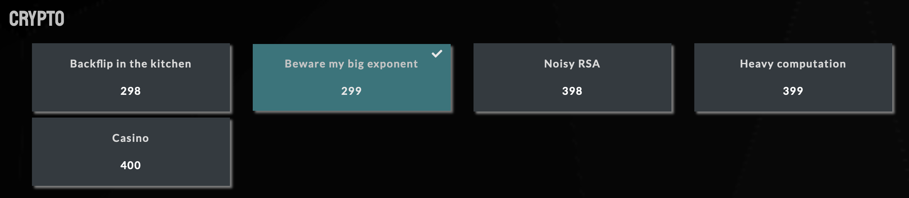

  

# Crypto

## Liste des challenges

* Backflip in the kitchen
* [Beware my big exponent](https://github.com/Hacktogone/SharkyCTF-2020/tree/master/Crypto/Beware_my_big_exponent.md)
* Noisy RSA
* Heavy computation
* Casino

## Challenges réussis 

