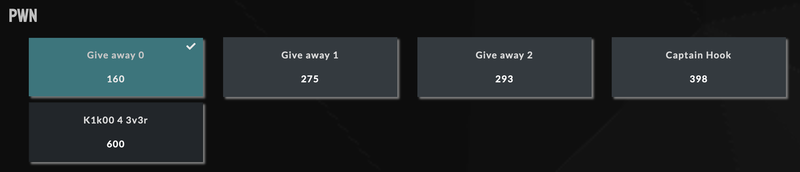

  

# PWN

## Liste des challenges

* [Give away 0](https://github.com/Hacktogone/SharkyCTF-2020/tree/master/PWN/Give_away_0.md)
* Give away 1
* Give away 2
* Captain Hook
* K1k00 4 3v3r

## Challenges réussis 

