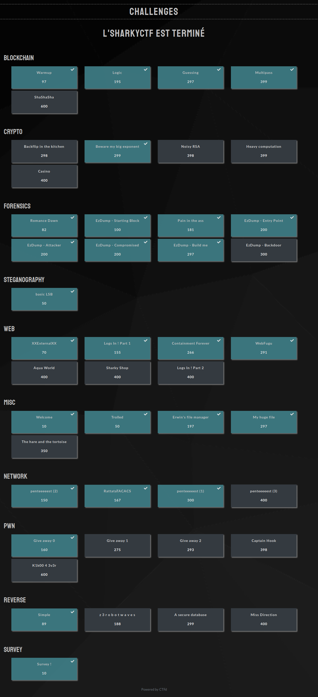

  

# SharkyCTF

## Composition des équipes

### Hack'togone (31/828)

* f0x-Tro0t
* st3p1n 
* RavenXploit 
* Ch4llengR 
* Kuraisis 

### Hack'togone 2 (57/828)

* Hexomedine 
* Protyro 
* Cocopops 
* Lyosky 
* jonathandadada 

## Liste des challenges

### Blockchain

* Warmup
* Logic
* Guessting
* Multipass
* ShaShaSha

### Crypto

* Backflip in the kitchen
* [Beware my big exponent](https://github.com/Hacktogone/SharkyCTF-2020/tree/master/Crypto/Beware_my_big_exponent.md)
* Noisy RSA
* Heavy computation
* Casino

### Forensics

* Romance Dawn
* Pain in the ass
* EzDump - Build me
* EzDump - Starting Block
* EzDump - Entry Point
* EzDump - Attacker
* EzDump - Compromised
* EzDump - Backdoor

### Steganography

* Basic LSB

### Web

* XXExternalXX
* Logs In ! Part 1
* Containment Forever
* WebFugu
* Aqua World
* Sharky Shop
* Logs In ! Part 2

### MISC

* Trolled
* Erwin's file manager
* My huge file
* The hare and the tortoise

### Network

* RattataTACACS
* [Penteeeeest (1)](./Network/penteeeeest.md)
* Penteeeeest (2)
* Penteeeeest (3)

### PWN 

* Give away 0
* Give away 1
* Give away 2
* Captain Hook
* K1k00 4 3v3r

### Reverse

* Simple
* Z 3 r o b o t w a v e s
* A secure database
* Miss Direction

## Challenges résolus

