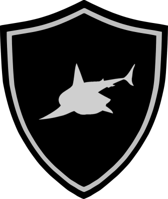

<p align="center">
  
</p>

# Basic LSB


## Statement

<p align="center">
  
</p>

## The Provided File

[pretty_cat.png](./files/pretty_cat.png)

## Introduction 

This challenge is about a known steganography method called LSB (Last Significant Bit).

## Challenge resolution

We start by opening the image : 

<p align="center">
  
</p>

With the title, i suppose that the data is hidden with the LSB method.

I simply used an online tool to decode the image and retrieve the data :

```
Well done, you managed to use the classic LSB method. Now you know that there's nothing in the sea this fish would fear. Other fish run from bigger things. That's their instinct. But this fish doesn't run from anything. He doesn't fear. Here is your flag: shkCTF{Y0u_foUnD_m3_thr0ugH_LSB_6a5e99dfacf793e27a}
```

## Flag 

```
shkCTF{Y0u_foUnD_m3_thr0ugH_LSB_6a5e99dfacf793e27a} 
```

Flagged by [Ch4llengR](https://twitter.com/Ch4llengR)

## Resources 

* [Least Significant Bit](https://www.boiteaklou.fr/Steganography-Least-Significant-Bit.html)
* [Online steganography tool](https://stylesuxx.github.io/steganography/)

